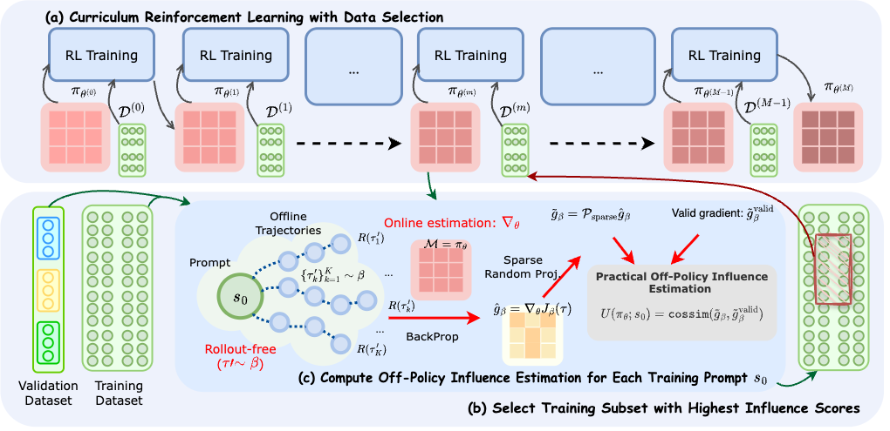
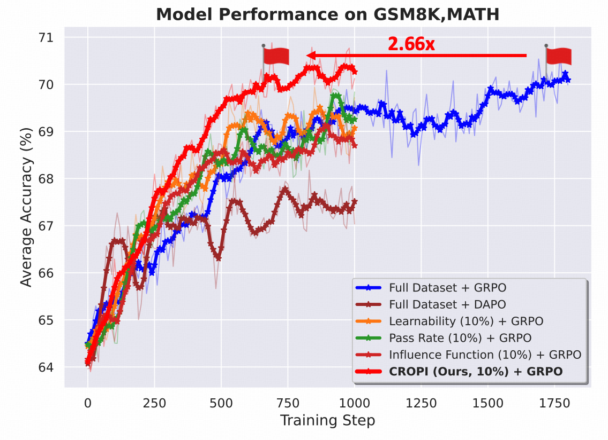
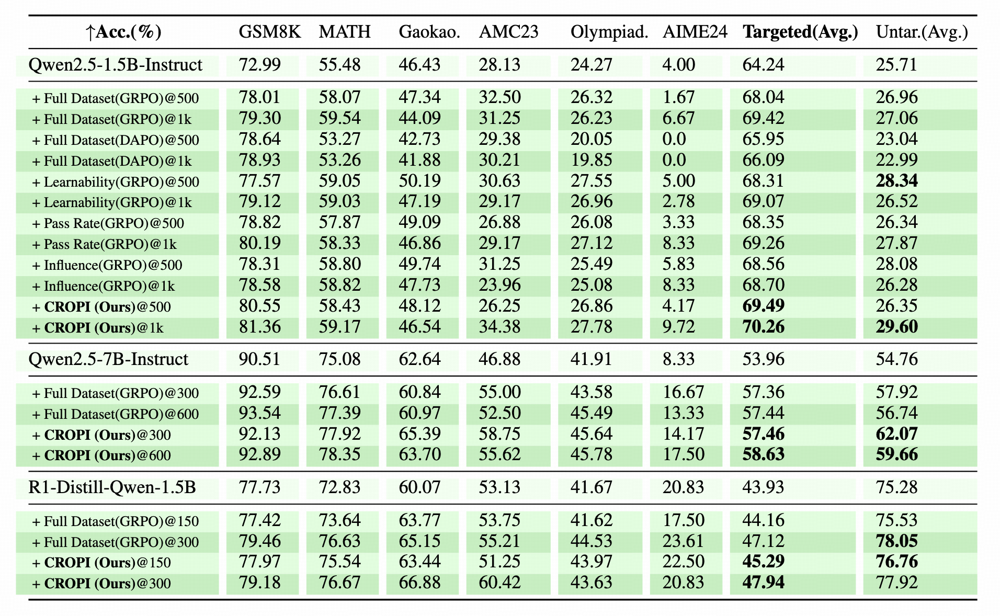
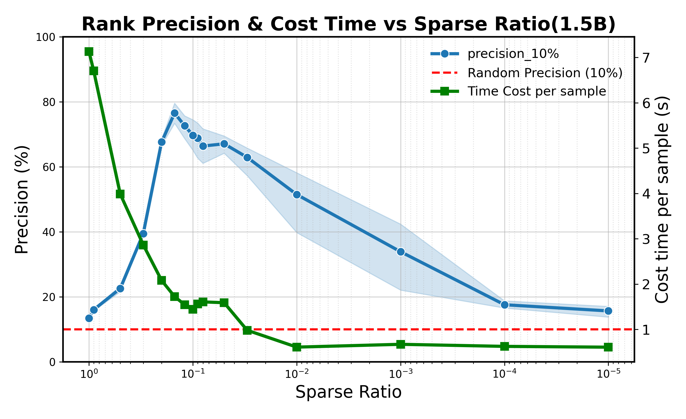
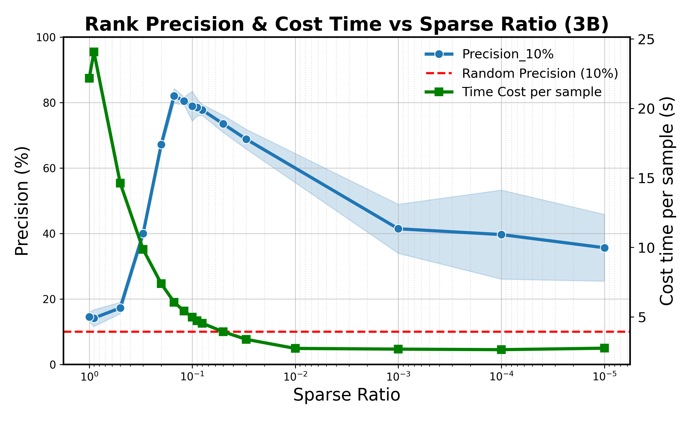

# CROPI
[](https://arxiv.org/abs/2510.26491)

**CROPI** is a curriculum reinforcement learning framework for large language models that brings theoretically grounded, rollout-free data selection to RLVR. It leverages influence functions to estimate how individual data points impact the current online policy using only pre-collected trajectories, enabling efficient and scalable training without costly new rollouts.


## News

[251101] We build the github repository. The detailed implementation of **CROPI** will be released as soon as possible. 

## Framework


1. **Off-Policy Influence Estimation**: quantifies per-datum impact on the online policy from offline trajectories, with theoretical guarantees and no real-time sampling.
2. **Scalable gradient handling**: Sparse Random Projection with a simple pre-projection dropout step to compress high-dimensional gradients, reduce numerical noise, and preserve inner products.
3. **Curriculum RL**: stage-wise training that selects the most influential data at each checkpoint, improving efficiency and performance over full-dataset and heuristic baselines.

## Highlight
On a 1.5B model, it delivers a **$2.66\times$** step-level acceleration while training on only **10%** of the data per stage—demonstrating the practical gains of influence-based data selection for online RLVR.
<!-- -->
<p align="center">

</p>


CROPI achieves consistent gains across **1.5B–7B and varied context lengths**.


**Sparse Random Projection** compresses LLM gradients for efficient processing and storage, **while mitigating numerical noise and retaining inner-product structure**. 
Following figures show how the dropout proportion of random projection (sparse ratio) effects the preservation of inner product of raw policy gradients in the setting of different model scales (1.5B-3B)
<p align="center">

</p>
<!--  -->
<p align="center">

</p>


## Citation
If you find our model or code useful in your research, please cite our paper:
```
@misc{zhu2025dataefficientrlvroffpolicyinfluence,
      title={Data-Efficient RLVR via Off-Policy Influence Guidance}, 
      author={Erle Zhu and Dazhi Jiang and Yuan Wang and Xujun Li and Jiale Cheng and Yuxian Gu and Yilin Niu and Aohan Zeng and Jie Tang and Minlie Huang and Hongning Wang},
      year={2025},
      eprint={2510.26491},
      archivePrefix={arXiv},
      primaryClass={cs.LG},
      url={https://arxiv.org/abs/2510.26491}, 
}
```